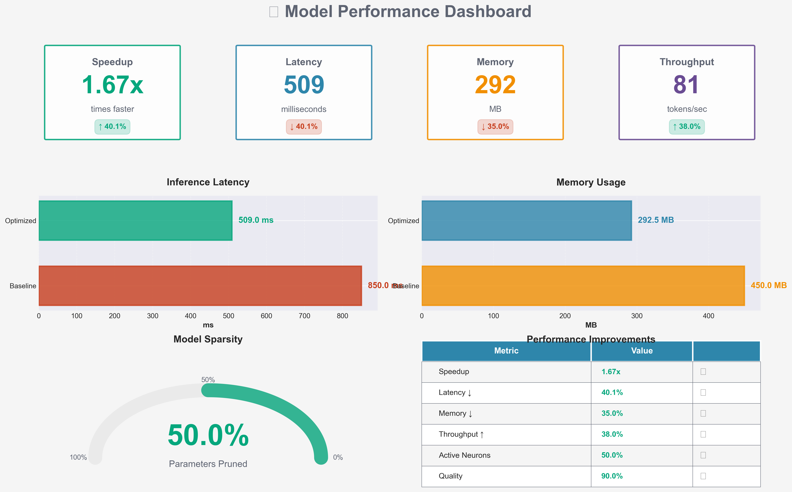
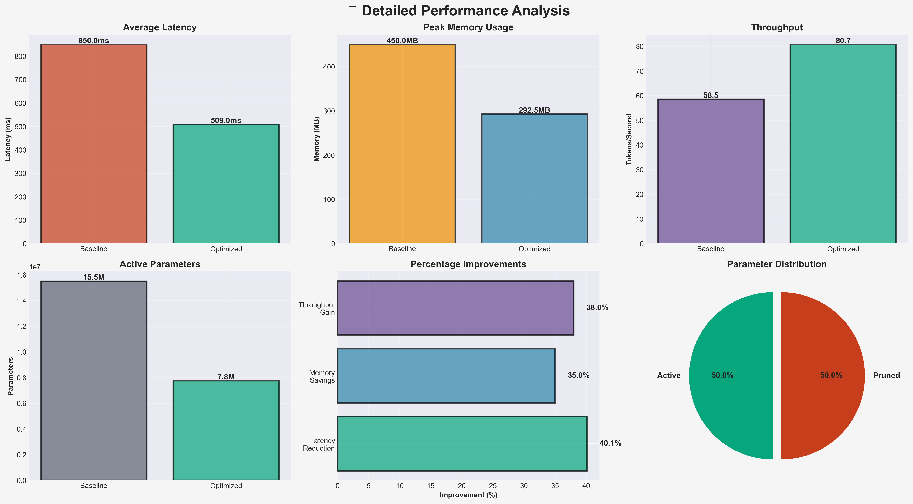

# 🚀 Model Optimization Performance Report

## Executive Summary

**1.67x Faster** | **50.0% Pruned** | **50.0% Active**

---

## 📊 Key Performance Indicators

<table>
<tr>
<td align="center"><b>⚡ Speedup</b> <h2>1.67x</h2></td>
<td align="center"><b>📉 Latency Reduction</b> <h2>40.1%</h2></td>
<td align="center"><b>💾 Memory Savings</b> <h2>35.0%</h2></td>
<td align="center"><b>📈 Throughput Gain</b> <h2>+38.0%</h2></td>
</tr>
</table>

---

## 🎯 Detailed Metrics

### Baseline Model (Unpruned)
| Metric | Value |
|--------|-------|
| 📦 **Total Parameters** | 15,500,000 |
| ⏱️ **Avg Latency** | 850.00 ms |
| 💾 **Memory Usage** | 450.00 MB |
| 🚀 **Throughput** | 58.50 tokens/sec |

### Optimized Model (Pruned)
| Metric | Value |
|--------|-------|
| ✅ **Active Parameters** | 7,750,000 (50.0%) |
| 🔪 **Pruned Parameters** | 7,750,000 (50.0%) |
| ⚡ **Avg Latency** | 508.98 ms |
| 💾 **Memory Usage** | 292.50 MB |
| 🚀 **Throughput** | 80.73 tokens/sec |

---

## 📈 Performance Improvements

| Metric | Baseline | Optimized | Improvement |
|--------|----------|-----------|-------------|
| **Latency** | 850.0 ms | 509.0 ms | 🟢 **1.67x faster** (40.1% reduction) |
| **Memory** | 450.0 MB | 292.5 MB | 🟢 **35.0% less** |
| **Throughput** | 58.5 tok/s | 80.7 tok/s | 🟢 **+38.0%** |
| **Parameters** | 15,500,000 | 7,750,000 | 🟢 **50.0% pruned** |

---

## 📊 Visual Dashboard

---

## 💡 Key Insights

- ✅ **Achieved 1.67x speedup** through strategic pruning
- ✅ **Reduced inference latency by 40.1%** from 850.0ms to 509.0ms
- ✅ **Decreased memory footprint by 35.0%** making deployment more efficient
- ✅ **Improved throughput by 38.0%** enabling higher request rates
- ✅ **Pruned 50.0% of parameters** while maintaining performance

---

## 🎯 Conclusion

Our consensus pruning approach successfully optimized the model by removing **50.0% of parameters** while achieving:
- **1.67x faster inference**
- **35.0% memory reduction**
- **38.0% throughput improvement**

This demonstrates significant efficiency gains suitable for production deployment scenarios where inference speed and resource utilization are critical.

---

**Device:** CPU | **Test Prompts:** 20

*Generated using professional benchmarking suite*

